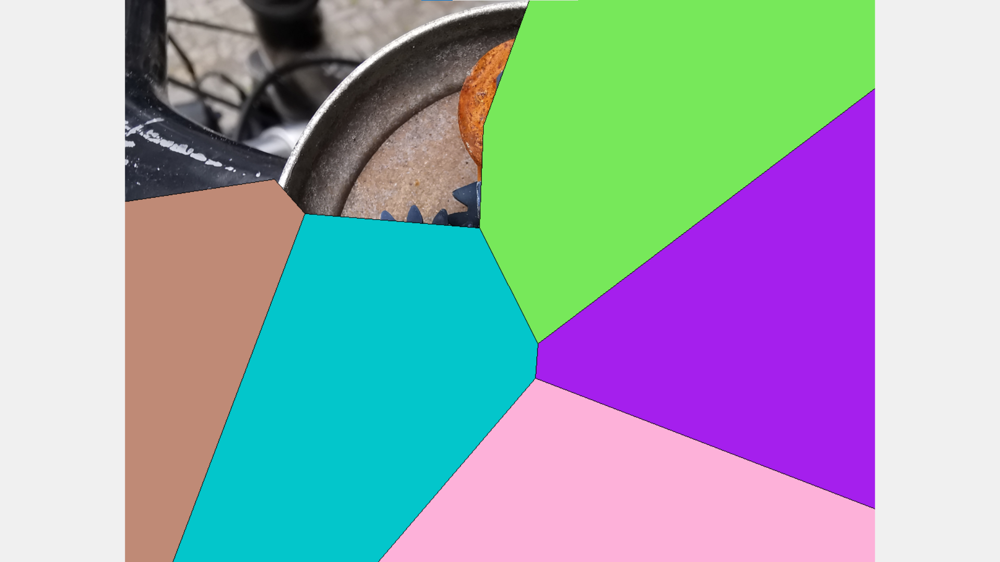
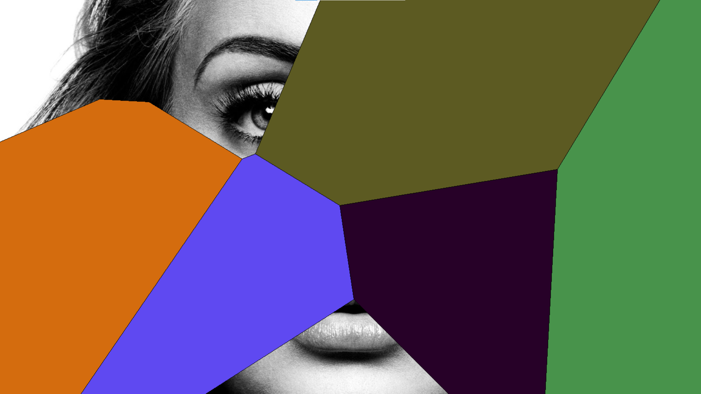

# Just Another 'Dalli-Klick'
Bilderrätsel angelehnt an das Spiel 'Dalli Klick' aus der Sendung 'Dalli Dalli'. Die Polygone zur Abdeckungen der Bilder werden zufälling per Voronoi-Generator erzeugt. Es gibt wie bei der Sendung Dalli-Dalli immer 9 Abdeckungen. 

## Entwicklungsumgebung

[Anaconda](https://www.anaconda.com/products/individual)
mit weiteren Abhängigkeiten wie z.B.:
[pillow](https://anaconda.org/conda-forge/pillow),
[shapely](https://anaconda.org/conda-forge/shapely),...

## Executable

Kann in der Anaconda Umgebung z.B. mittels [PyInstaller](https://github.com/pyinstaller/pyinstaller) erzeugt werden:

python -OO -m PyInstaller --onefile Main.py

## Progammstart

In der Anaconda Umgebung start mittels:

python Main.py ".\images"

Die Bilder im übergebenen Ordner werden angezeigt. 

## Bedienung
Anwendung kann mittels Tastenkombination oder Mousetasten bedient werden:

Enter, Rechte-Mousetaste    - nächstes Bild

Leertaste, Linke-Mousetaste - nächstes Polygon aufdecken

## Screenshots

